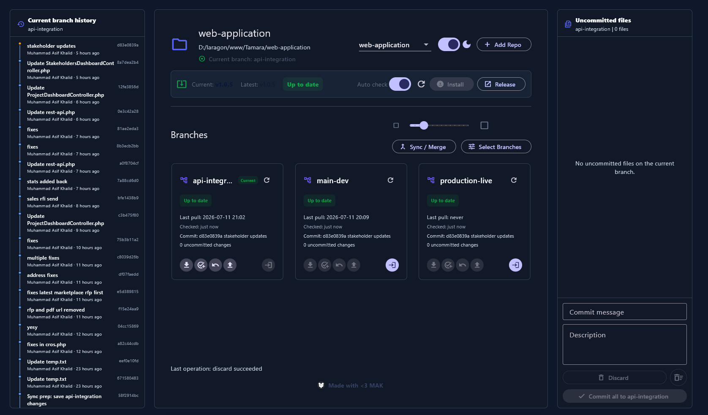
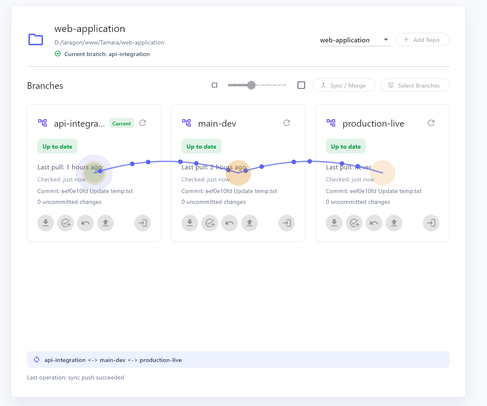
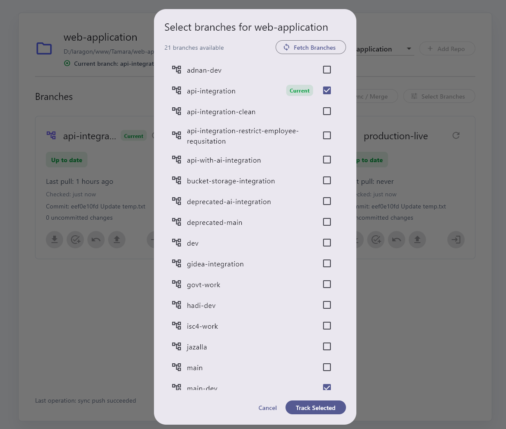
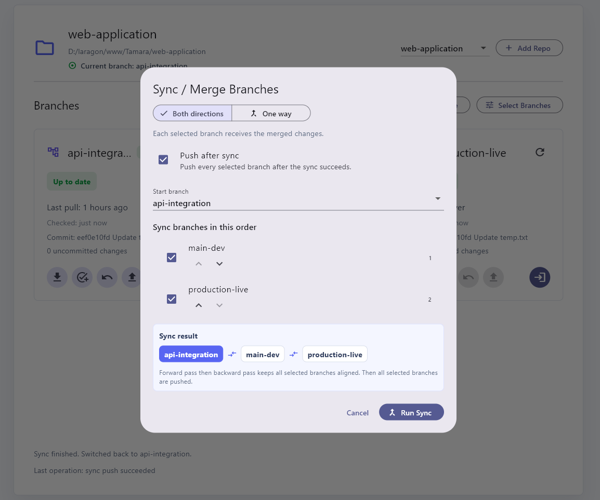

<p align="center">
  
</p>

# Git Flow

Flutter desktop app for managing local Git repositories across selected branches.

## Features

- Add a local Git repository from a folder.
- Select branches to track.
- View branch freshness, latest commit, pull time, and local changes.
- Pull, commit, undo commit, push, refresh, and checkout the current branch.
- Sync and merge selected branches in one-way or both-directions mode.
- Optionally push synced branches after sync finishes.
- Return to the selected start branch after sync completes.

## Screenshots

### Responsive Dark Dashboard



### Dashboard Sync View



### Branch Selector



### Sync / Merge Dialog



## Build

A Windows x64 release build is included:

[releases/GitFlowSetup-v1.0.12.exe](releases/GitFlowSetup-v1.0.12.exe)

[releases/git_flow_windows_x64_release.zip](releases/git_flow_windows_x64_release.zip)

## Development

```powershell
flutter pub get
flutter analyze
flutter test
flutter build windows
```
